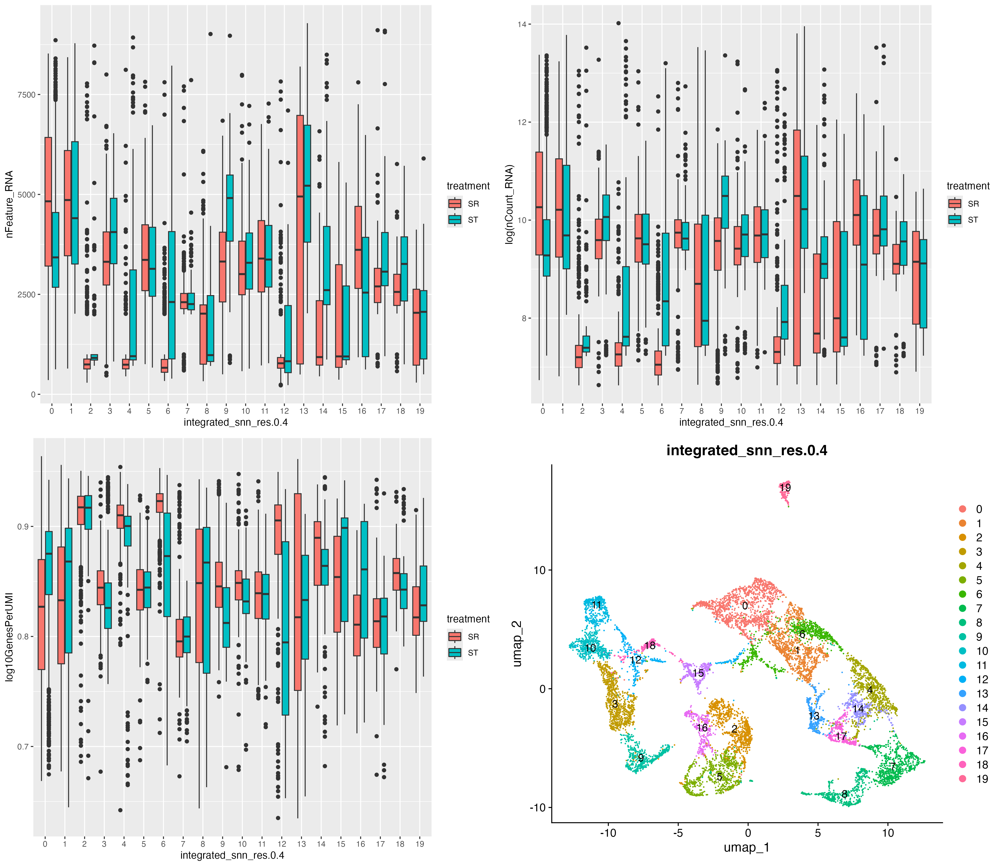
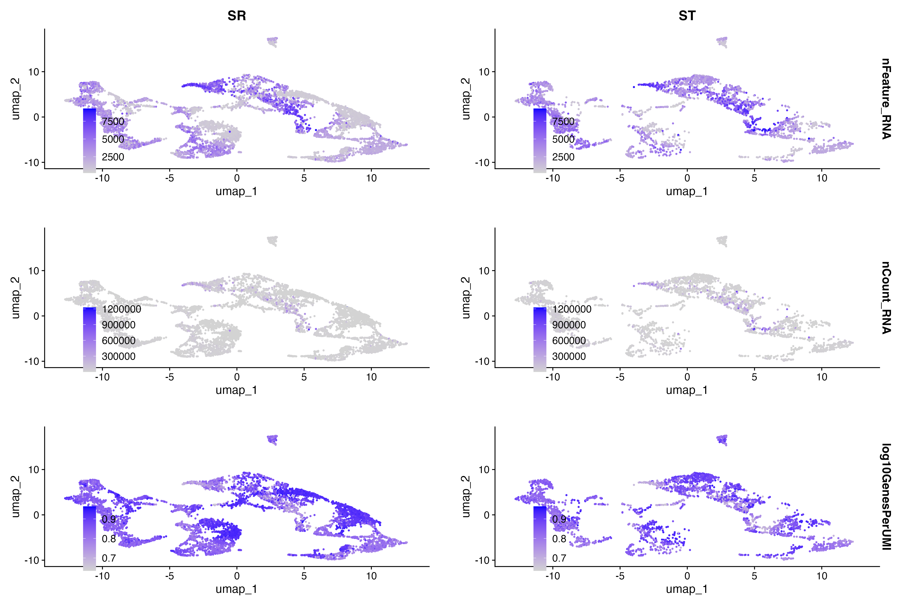
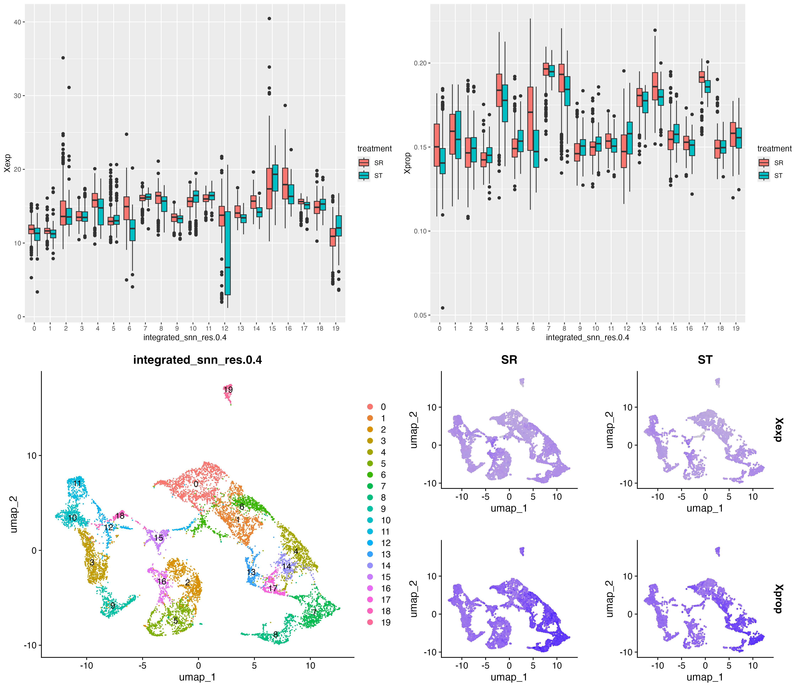

FILTERING THRESHOLDS 
=====================

Filters
-------

- Mitofilter: remove cells with higher mitochondrial expression than the filter, e.g 0.5, remove if more than 50% of transcripts are of mitochondrial origin
- Feature filter: remove cells that are expressing less than this number of features/genes
- Complexity filter: ratio of features per transcript. Low-complexity cells are often dying however this is variable and dependent on the biology of your sample

Final thresholds to use. 

-   Mitofilter 20% because clear cluster of cells with both high mitochondrial (cluster 6) that has also has low complexity. 5% removes lots of cells outside the distribution and so appears to be stringent. We also may expect high energetic output of the testis in general 

-   No complexity filter as mitochondrial appears to capture dying cells. Also temporal patterns of number of genes expressed across spermatogenesis (lots early on and few late on). This doesn't appear to be a standard filter

-   No upper threshold on nfeatures but use the lower threshold of 200 (the done thing across the literature)

Google sheet for filtering thresholds in literature: 

<https://docs.google.com/spreadsheets/d/1AiUcjYntJXEte5gfKSrbC_slKvVhC1lsaYZYsuSY23s/edit#gid=0>

MARKERS AND CLUSTERING 
=======================

Clustering and cluster number
-----------------------------

-   Number of dimensions/PCAs: Use an elbow plot to determine where the majority of variation is explained/less variation is being explained by the inclusion of each subsequent dimension. This defines the shape of your final UMAP (it is based of the first x PCA dimensions)

-   Resolution: Determines the granularity of the final number of clusters

Elbow plot levels at around 20PCAs and when looking at the variation explained it's at PCA 21 so 21 PCs are taken forward for UMAP/clustering etc.

There is no obvious point where the clustering number flattens with resolution so choice based on biological interest, can condense clusters later. Resolution of 0.5 used as slope flattens a bit and gives a freedom to condense.

Celltype ID
-----------

Google Sheet for final markers 

<https://docs.google.com/spreadsheets/d/1SWU0PVAlVUOg62B5bLI4oXQtyqimmhFILa69MzQbad0/edit#gid=0>

Sources for marker genes for testis cell types 

-   Witt 2019, Witt 2021, Witt 2023, Wei 2022 (Preprint), Mahadevaraju 2021

Approach for identifying markers 

-   Initial orthology check: OMA results in annotation and orthogroup information 

-   Double-check: blast, align and build trees for all hits within orthogroup/OMA

-   First broad groupings including Cyst, GSC, Spermatagonia, Spermatocyte, Spermatid

Dotplots of marker expression grouped by specificity. 
High) groupings KEY: GSC: Germline Stem Cell, G: Spermatogonia E1:Early Primary Spermatocytes M1:Middle Primary Spermatoctyes, L1:Late Primary Spermatocytes, SS: Secondary Spermatocyte, EST: Early Spermatid, LST: Late Spermatid C:Cyst C1-4:Cyst Cell Lineage 1-4, T: Terminal Epithelial Precursors, P: Pigment Cell Precursors, H: Hub, E: Epithelial, AC: Accessory Gland) and 

Medium) KEY G: GSC/Spermatagonia, PS: Primary Spermatocyte, SS: Secondary Spermatocyte, ST: Spermatid, C: Cyst E: Epithelial, H: Hub, AC: Accessory Gland).

Low) groupings KEY: G:GSC/Spermatagonia, S: Spermatocyte, ST: Spermatid, C: Cyst E: Epithelial, H: Hub, AC: Accessory Gland).

Based on Witt papers, key markers to look at maybe twe (discerns spermatids from spermatocytes) and vas/vasa (denotes the start of spermatogenesis)

**Specificity**

High

Medium

Low

**Cluster Assignment**

Based on marker expression the following assignments have been made 

|Cluster|Celltype Specific| Celltype Narrow | Logic| 
|---|---|---|---|
|0|GSC/G|GSC/G|Express suite of GSC/G genes with strong vas expression (start of spermatogenesis)|
|1|GSC/G|GSC/G|Express suite of GSC/G genes with strong vas expression (start of spermatogenesis)|
|2|SR-specific/NA|NA| No obvious marker expression, low-feature/high complexity|
|3|Cyst|Cyst|Expresses suite of Cyst markers, not clear which cyst type|
|4|SR-specific/NA|NA|No obvious marker expression, low-feature/high complexity|
|5|Cyst|Cyst|Expresses suite of Cyst markers, not clear which cyst type|
|6|SR-specific/NA|NA||
|7|Early Spermatid|Spermatid|Similar expression in general to spermatocytes but do not express twe so not spermatocytes. Has closer expression to spermatocytes than 8 so maybe earlier stage. Also reduced number of expressed genes|
|8|Late Spermatid|Spermatid|Similar expression in general to spermatocytes but do not express twe so not spermatocytes. Also reduced number of expressed genes|
|9|Cyst|Cyst|Expresses suite of Cyst markers, not clear which cyst type|
|10|Cyst|Cyst|Expresses suite of Cyst markers, not clear which cyst type|
|11|Cyst|Cyst|Expresses suite of Cyst markers, not clear which cyst type|
|12|NA|NA|Some cyst markers and close in space but very low expression|
|13|Primary spermatocyte|Spermatocyte|Also expresses cyst markers but cyst doesn't express PS markers|
|14|Spermatocyte|Spermatocytes|Unclear primary or secondary|
|15|NA|NA|Some cyst markers and close in space but very low expression|
|16|NA|NA|Some cyst markers and close in space but very low expression|
|17|Spermatocyte|Secondary Spermatocyte|Number of features expressed starts to drop off at this point in keeping with [Witt et al. (2019)](https://iiif.elifesciences.org/lax/47138%2Felife-47138-fig2-v1.tif/full/1500,/0/default.jpg)|
|18|NA|NA|Some cyst markers and close in space but very low expression|
|19|Muscle|Muscle|Expresses Mhc, marker for muscle|

**Extra data for celltype ID**
Expectations are for number of features expressed across spermatogenesis to reduce and likewise see X-chromosome inactivation
Feature expression pattern supports expected expression patterns however no evidence for XCI. In fact there appears to be an increase in the proportion of X-linked transcripts and X-linked expression in total across spermatogenesis: does this point to disruption of the standard routes of XCI brought about through meiotic drive. This is however present in both populations so maybe not? However the ST X may still carry the machinary required for SR-suppression and may be turned on

Barplots of feature and UMI expresssion

FeaturePlots of feature and UMI expression 

X expression patterns 

**Ploidy Check**
Using scAlleleCount and various thresholds, we explored whether we could detect haploid cells 

In each cell of the plot, the top number refers to the depth threshold and the bottom number is the SNP threshold
For heterozygote sites, the depth threshold has to be passed for both alt and ref reads. For the homozygote site to be called, they need greater than twice this threshold mapping to either ref or alt and 0 to the other.
The snp threshold is the minimum number of SNPs required to call a cell haploid or diploid 

See <https://docs.google.com/spreadsheets/d/1AiUcjYntJXEte5gfKSrbC_slKvVhC1lsaYZYsuSY23s/edit#gid=0>

METHODS
=======

Reference genome
----------------

ST_FINAL.fa

Annotation - Sade & Christophe working on this

mtDNA 
------

A reference mitochondrial genome was assembled using mitoHifi with data from xx and xx

(There are two fasta files from two SMRT cells, from the same sample so they can be combined).

I've also put there the folder of results that Alex sent from when she ran it. Her methods/commands are here: <https://github.com/alexjvr1/Stalkies/blob/main/mitoGenome.md>

To add mitochondrial reference to genomic reference do the following: 

- Convert DB to gff

- Merge with Genomic DNA

- Convert to GTF

- Remove quotations

- change tRNA to exon 

- change rRNA to exon

#### OLD ----

Filtering steps, decisions to date:
-----------------------------------

1\. Cell Ranger

i) use filtered Cell Ranger output

Notes: imposes a custom UMI threshold and is specific to each sample. We double checked that there are no weird inflection points for the samples that are filtering out some cell populations. We do get many more cells using the unfiltered output and imposing our own 500 UMI but less specific to the sample, also sr4 cells numbers are very unrealistic. Maybe go back and decide after seeing how many cells in each population.

UMI threshold imposed by CellRanger for each sample: <https://docs.google.com/document/d/1JyscLZ-XDGEOAr4pvBXLjiQ3oy1N7dFK/edit>

i) keeping genes expressed in at least three cells 

Cell cycle markers incorporated

5. Integrate

All 8 samples together. Tried separately and ruled out.

6\. Remove doublets: We used the function 'doubletFinder_v3' from theDoubletFinder v2.0.3 package (McGinnis et al. 2019) in R to identify and remove doublet

7\. Reciprocal ortholog identification

Using old stalkie reference genome 

Orthofinder 

Number of transcripts for Stalkie: 

Number of transcripts for Drosophila: 

Number of orthologs: 

Testes markers: <https://docs.google.com/document/d/1k85yNKhAET0U1xB9_-ukp_KJaUqDHtpt6Pt57FbeWJE/edit#>

Elife: 9 cell types (3 somatic, 6 germ line). 13 cell type markers

Germline stem cells (GSC): aubergine (aub)

Spermatogonia: bag of Marbles (bam)

Late spermatogonia: vasa and bam enrichment but not aub

Early spermatocytes: fuzzy onions (fzo) enrichment

Late spermatocytes: twine (twe) but not fzo enrichment

Late spermatids: P-cup

Epithelial cells: MntA and Hsp23

Hub cells: Fas3

Cyst cells: Zfh1

PLoS Genetics: 11 cell type markers (more up to date)

Germline stem cells (GSC)/early spermatogonia: aubergine (aub) + bag of Marbles (bam)

Late spermatogonia: slight bam enrichment, but less His2av than GSC/early spermatogonia

Early spermatocytes: highest enrichment of fuzzy onions (fzo)

Late spermatocytes: twine (twe) but not fzo enrichment

Early spermatids: Dpy-30L2 but no fzo or twe

Late spermatids: P-cup

Epithelial cells: MntA but not Fas3

Hub cells: Fas3

Cyst cells: Rab11

BioRxiv: 12 cell types (4 unknown, 1 somatic, 7 germ line). 25 cell type markers

AEW eyeballing

Germline stem cells (GSC)/spermatogonia: high vasa

Spermatogonia/Early spermatocyte: high vasa and aub

Early spermatocytes: highest enrichment of fuzzy onions (fzo)

Late spermatocytes (x2): high twine (twe) 

Early spermatids: 

Late spermatids: cup genes expressed really highly (e.g f-cup, m-cup, r-cup, wa-cup)

Cyst cells/Hub cells: Highest expression of MtnA and Eya. Fas3 and Zfh1 also expressed highly

Evolutionary Rates 
-------------------

-   Calculcate rates of Dn/Ds across the X for both drive and standard

-   Expectations: elevated rates of evolution on the SR-X associated with arms race with repressors on the Y

-   Also, potentially due to reduced recombination with ST-X, we may observe  elevated rates of sequence divergence

Differential abundance analysis 
--------------------------------

Differential gene expression analysis 
--------------------------------------

Identifying Y-linked transcripts 
---------------------------------

Variant calling to ID haploid/diploid cells for cell type verification 

1.  Variant calling using GATK 

1.  MarkDuplicates: mark and remove duplicates 

2.  SplitNCigarReads

3.  HaplotypeCaller 

4.  Vcftools variant filtering

1.  minGQ 20, minDP 10, minQ 30

3.

RESULTS
=======

1.  Single cell atlas of Teleopsis dalmanni testes
    ----------------------------------------------

-pooled across all samples

Figure. Single-cell atlas of Teleopsis dalmanni testes

1.  Testing the effect of meiotic drive on Teleopsis dalmanni spermatogenesis
    -------------------------------------------------------------------------

Figure/ Table, stats

-identify differences in cell type abundance (trajectory analysis, density plot)

Figure. Density plot

-test when Y bearing sperm die: relative abundance of spermatogenesis cells

-identify differentially expressed genes (across genome but also within inversion)

1.  Test for compensatory evolution to meiotic drive
    ------------------------------------------------

-test if relative abundance of testes cell types varies (probably not able to check if absolute numbers vary e.g if produce more sperm overall, check if ratio of somatic to germ line cell varies)

1.  Characterising the driver
    -------------------------

-   Differentially expressed genes in inversion

-   Rates of sequence evolution within the inversion and intersection with DGE

FIGURES

Figure 1. Single-cell atlas of Teleopsis dalmanni testes

Figure 2. Trajectory analysis of spermatogenesis in standard (A) and drive (B) males

TABLES

Table 1: Relative abundance of testes cell types

Table 2: Relative abundance of spermatogenesis cells

 SUPPLEMENTARY TABLES

Table S1: Information about scRNA-seq in each sample

Figure S1: Dot plot of cell marker expression in each cluster

DISCUSSION
==========

ACKNOWLEDGEMENTS

This work was funded by a NERC Independent Research Fellowship to AEW (NE/N013948/1), a NERC ACCE DTP to PDP ..... We thank NEOF etc .... for helpful comments and suggestions on the manuscript. We acknowledge IT Services at The University of Sheffield for the 

provision of services for High Performance Computing.

AUTHOR CONTRIBUTIONS

AEW and PDP designed the research. PDP collected the data. PDP & SP analyzed the data. AEW, PDP & SP wrote the manuscript with input from all authors.

DATA AND CODE AVAILABILITY STATEMENT

REFERENCES
